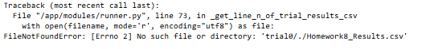
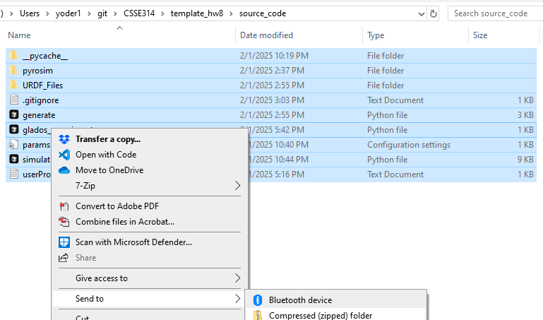
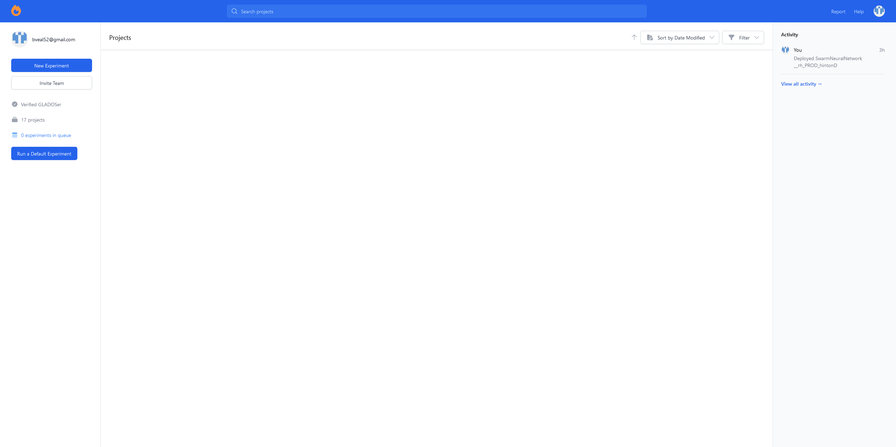
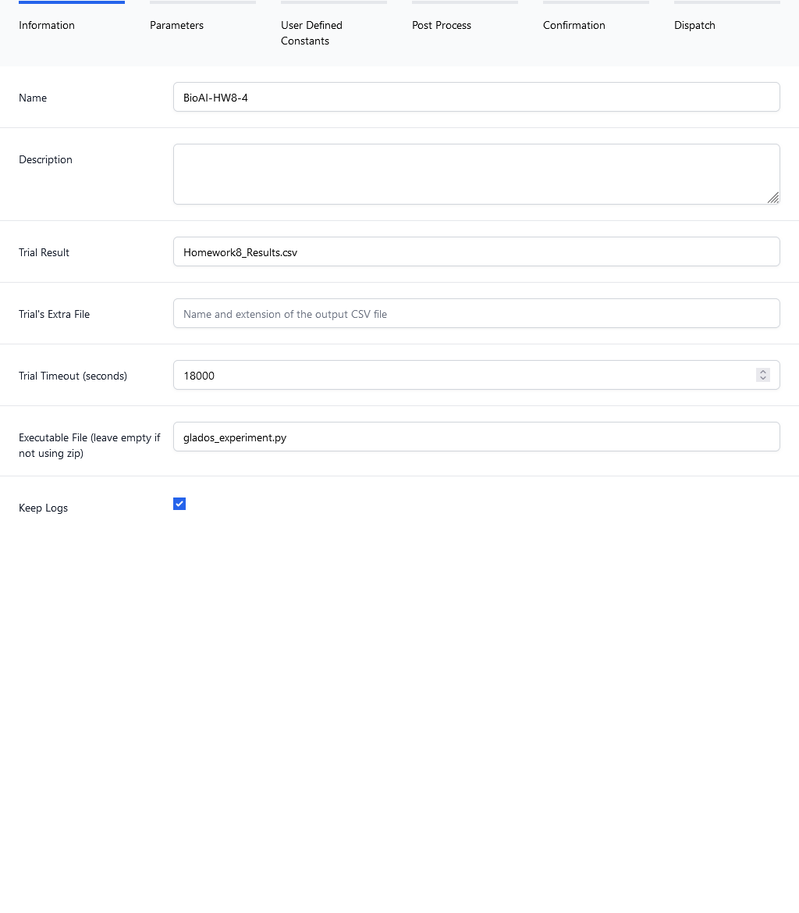
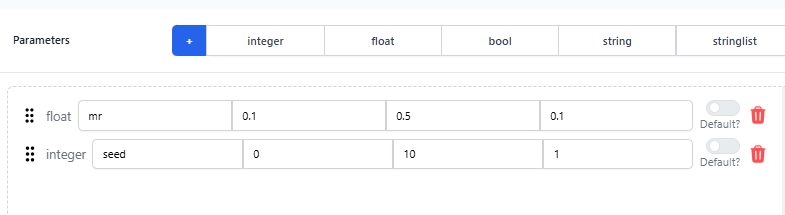
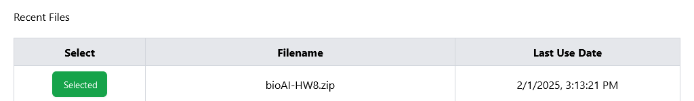
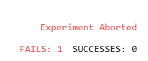
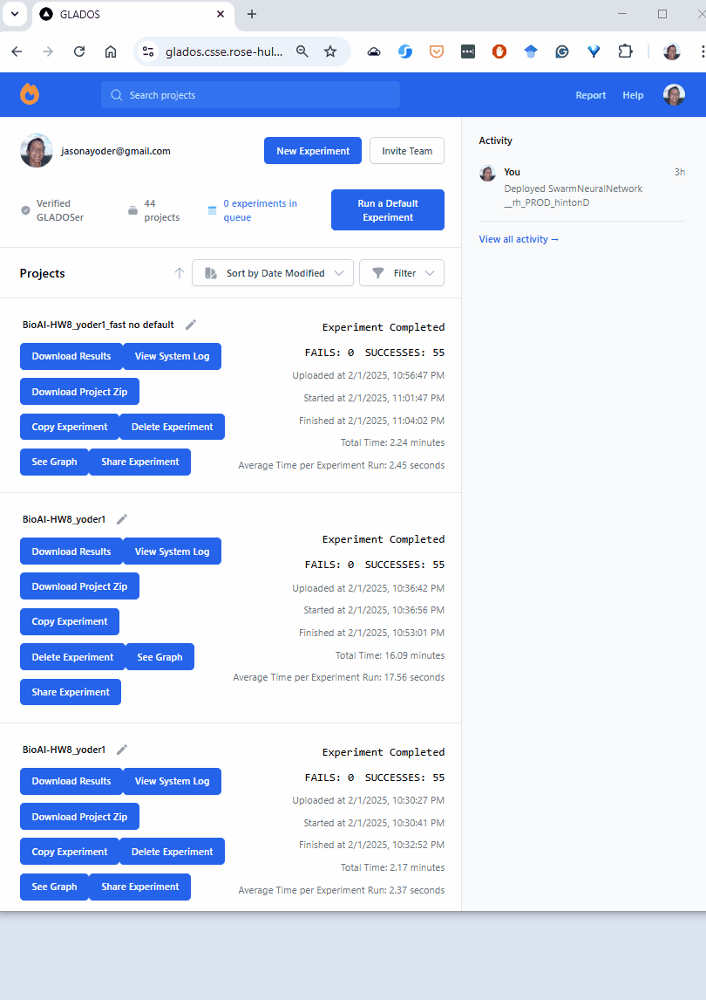

# BioAI HW 8 User Guide

This guide is intended for students in CSSE314 BioAI to utilize the GLADOS system to run their completed code.

!!! warning
    HW8 needs to be completed in order for this to run. The code needs to have succeeded in running the evolution to completion (but it does not need to be a great behavior, just some *completed* behavior).

## Step 1: Format the .zip File for the Project

There are a couple things that need to be changed in the HW8 files to ensure that this project runs on GLADOS.


First, in `fitness_function`, this line needs to be changed:

```python
    BEFORE: robotid = p.loadURDF("./URDF_Files/armsBody.urdf")
    AFTER:  robotid = p.loadURDF("../URDF_Files/armsBody.urdf")
```

!!! note
    If you do not make the change above, GLADOS will error. The error will look similar to this:

    

Then, zip all of the project files into a single `.zip` and give it a appropriate name. (e.g. *bioAI_HW8_{RHITUSERNAME}.zip*).

Here is a screenshot of the files in the source_code folder to be zipped:



## Step 2: Create and Run a New Experiment

First, log in with your Google or GitHub account to access the [GLADOS Homepage](https://glados.csse.rose-hulman.edu). This is the screen that wil be presented when the user is logged in:



### Information Step

In the top left of the page, select the  button to open the new experiment panel.

Fill in the following details:

- **Name**: Any appropriate name (e.g., *BioAI-HW8_{RHITUSERNAME}*)
- **Trial Result File**: Set to ***Homework8\_Results.csv***
- **Trial's Extra File**: Set to ***./***
- **Trial Timeout (hours)**: 5 (default)
- **Executable File**: Set to ***glados\_experiment.py***

Once completed, click the **Next** button.

Example:



### Parameter Step

Next, set up the parameters that GLADOS will handle during the experiment. 

Select `float` from the Parameter list. A new float will appear in the parameters section below. This `float` parameter needs to include the following information:

* name: mr
* min: 0.2
* max: 0.5
* step: 0.1

Now select `integer` from the Parameter list. A new integer will appear in the parameters section below. This `integer` parameter nees to include the following information.

* name: seed
* min: 0
* max: 10
* step: 1

When completed, the parameters section will look like this:



When completed, click **Next**.

### User Defined Constants

These constants ensure that GLADOS and the inserted code recognize the correct variables. Copy and paste the following block into the **User Defined Constants** section to map the parameter mr to the mutation_probabilty variable and the parameter seed to the random_seed variable.

```
num_inputs = 4
num_classes = 4
num_solutions = 10
hidden_activations = sigmoid
output_activation = sigmoid
num_parents_mating = 5
num_generations = 2
mutation_probability = {mr}
parent_selection_type = rank
crossover_type = scattered
mutation_type = random
keep_parents = 0
random_seed = {seed}
```

When pasted, click **Next**.

### Post Process

Leave this box unchecked. Click **Next**.

### Confirmation Step

This step reviews the experiment setup. If the previous steps were followed correctly, the confirmation page should resemble the following:

```json
  {
  "hyperparameters": [
    {
      "name": "mr",
      "default": -1,
      "min": "0.2",
      "max": "0.5",
      "step": ".1",
      "type": "float",
      "useDefault": false
    },
    {
      "name": "seed",
      "default": -1,
      "min": "0",
      "max": "10",
      "step": 1,
      "type": "integer",
      "useDefault": false
    }
  ],
  "name": "BioAI-HW8-{RHITUSERNAME}",
  "description": "",
  "trialExtraFile": "",
  "trialResult": "Homework8_Results.csv",
  "scatterIndVar": "",
  "scatterDepVar": "",
  "dumbTextArea": "\nnum_inputs = 4\nnum_classes = 4\nnum_solutions = 10\nhidden_activations = sigmoid\noutput_activation = sigmoid\nnum_parents_mating = 5\nnum_generations = 2\nmutation_probability = {mr}\nparent_selection_type = rank\ncrossover_type = scattered\nmutation_type = random\nkeep_parents = 0\nrandom_seed = {seed}",
  "timeout": 5,
  "scatter": false,
  "workers": 1,
  "file": "679e806160f8c8d0c659037d",
  "status": "CREATED",
  "experimentExecutable": "glados_experiment.py"
}
```

Click **Next**.

### Dispatch Step

If this is the users first experiment, the "Recent Files" section in the Dispatch Step will be empty. To add a file, drag the `.zip` file created in Step 1 into the **Upload** dropbox:


Once uploaded, the file will appear as successfully selected for the experiment:



Click the **Dispatch** button to send the experiment to GLADOS.

!!! note
    If the experiment fails, the result on GLADOS will look like this:

    

    If this happens, review the above steps to ensure that the experiment was set up correctly. If you are confused why it failed, you can use the **System Log** button to review the logging of the experiment run to see possible reasons for failure.

    **Note**: You will have to scroll through the log file to find where the error happens. It may not be obvious by just briefly scanning the log file.

    See the **FAQ** section if you are repeatedly unable to run an experiment.

## 3. Reviewing Results

After the experiment completes, several buttons appear to review and download data:

- **Download Results**: Click to download the raw `.csv` file.
- **Download Project Zip**: Click to download the `.zip` file containing project and run data.
- **See Graph**: Click to open an interactive graphing module to visualize variable changes during the experiment. For more detailed informtion, view the gif below:



## 4. FAQ

### GLADOS Dev Team Contact Information

For help with running this project, contact Dr. Yoder via email or Teams and he can forward any concerns or questions to the GLADOS Dev Team.

If there are any errors or bugs with GLADOS, a report can be submitted via the **Report** button at the top right of the GLADOS page.