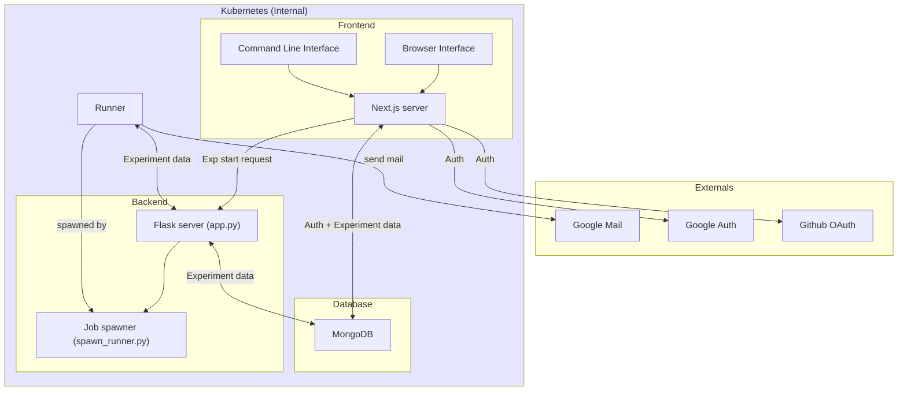
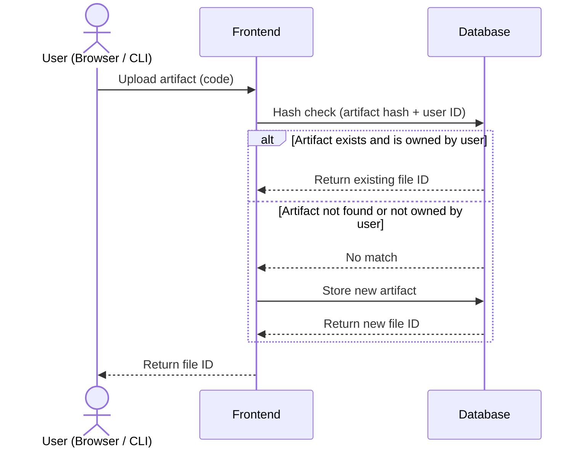
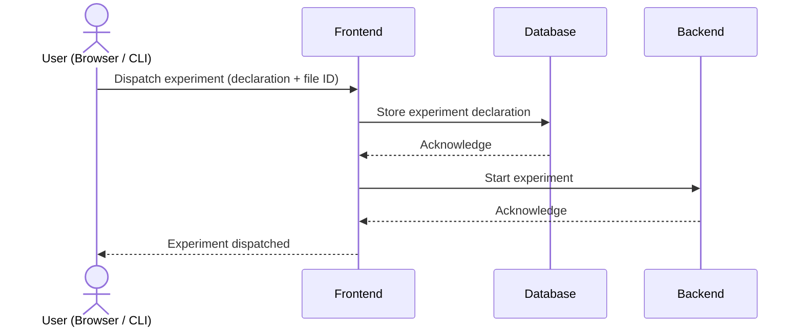
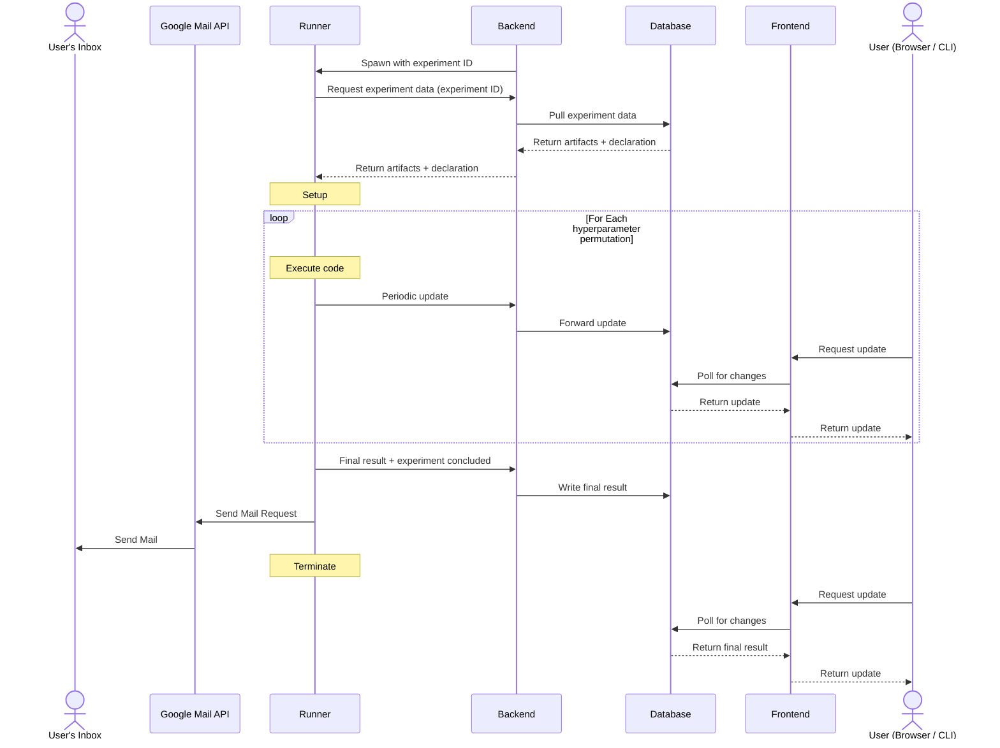

# Architecture document

## Overview
The GLADOS backend is written in Python and have direct access to the Kubernetes (k8s) infrastructure. The primary function of the backend is to manage experiments through its Flask endpoints. 

The facility that runs the users' experiments are called **Runners**. The Runners are spawned as a `k8s Job`, a type of `pod` that runs a specific command within its container(s) and self terminate once the command finishes execution. 

## Components map

        
## Data flow narrative: Running a successful experiment
### 0. Naming Convention
Since architecture does not have to be dependent on implementation details, the narrative will use the following naming scheme to describe components within the system:
- **Frontend** -> Next.js server, handles general application logic (auth, uploads, etc...)
- **Backend** -> Flask server, handles core business logic
- **Database** -> MongoDB, handles all data storage
- **Runner** -> Virtual container, run users' code and collect results 

### 1. Initial Artifact Upload
An authenticated user wish to start an experiment. From the browser or command line interface, the user first uploads the code that they want to run by making a request to the `Frontend` server. 

The `Frontend` will return a file id of the uploaded artifact to be used for experiment declaration. Before actually uploading, the `Frontend` perform a hash check with the `Database` to avoid keeping copies of the same code artifacts. If the artifact already exists and owned by the user, the server will reuse the existing file id instead of uploading the same copy of the artifact.

### 2. Dispatching Experiment
After the user declared the experiment and proceed with dispatch, the `Frontend` server will upload the experiment declacration to `Database`, then call on the `Backend` to start the experiment.

### 3. Running the Experiment and Collect Result
The `Backend`, upon receiving the request to start the experiment, will spawn a child process to create the `Runner` and give it the experiment id to be run.

The `Runner`, upon starting, uses the experiment id to request the full experiment data from the `Backend` (code artifacts and experiment declaration). Next, The `Runner` will perform the necessary setup steps, and run the code on all possible permutations of hyperparameters that the user specified. Througout the duration of the `Runner` lifespan, it periodically send updates to `Backend`, which forwards it to `Database`. `Frontend` is actively watching for these changes in order to deliver live experiments updates. 

When the `Runner` finishes running all hyperparameters permutations it will package the result, and send it to `Backend` along with a final update indicating that the experiment has concluded. `Backend` will write the data to `Database`, which `Frontend` will automatically pull. Finally, the `Runner` will send an email to the user notifying them of the experiment completion via the `Google mail API`

